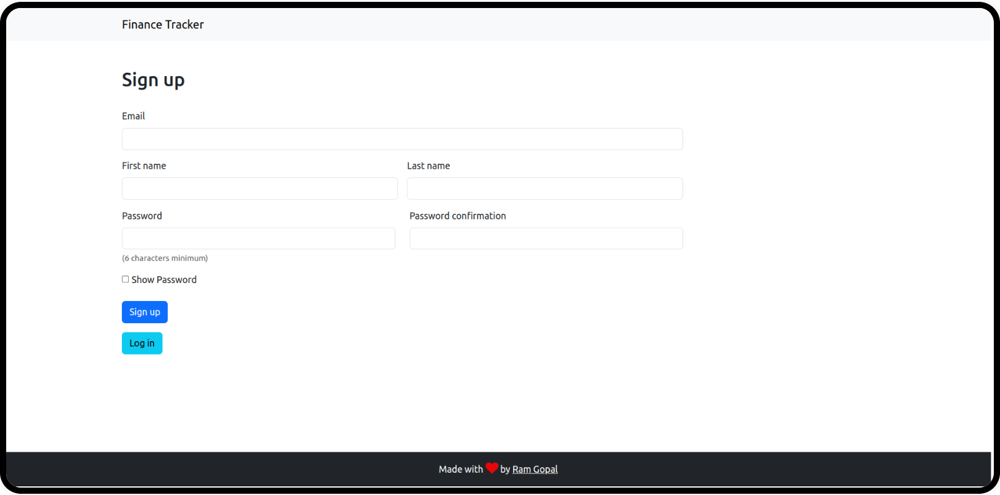
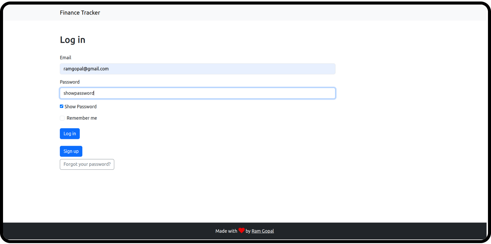
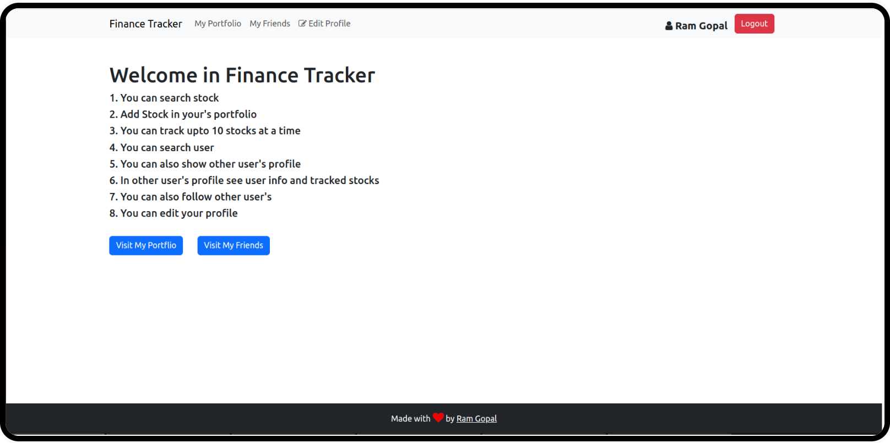
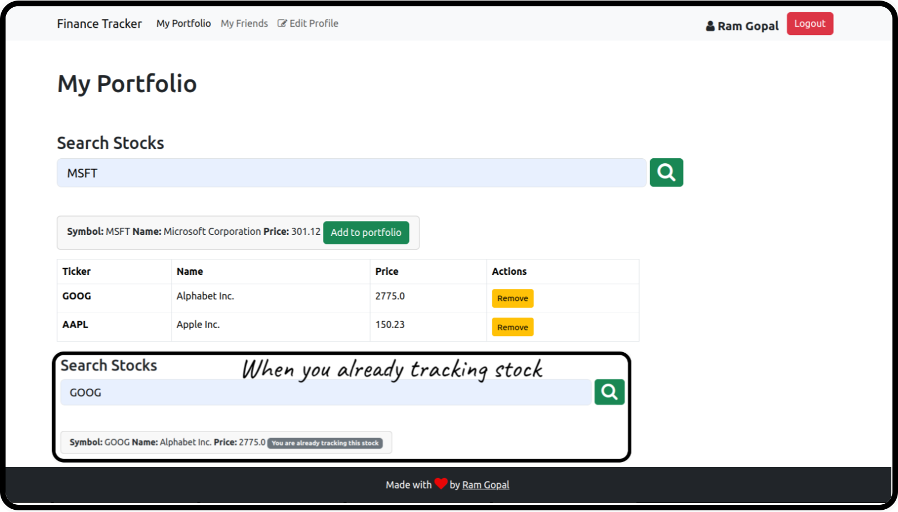
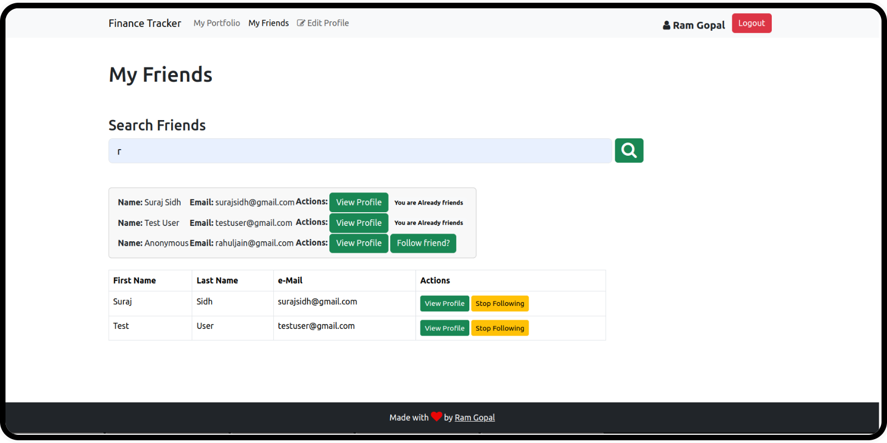
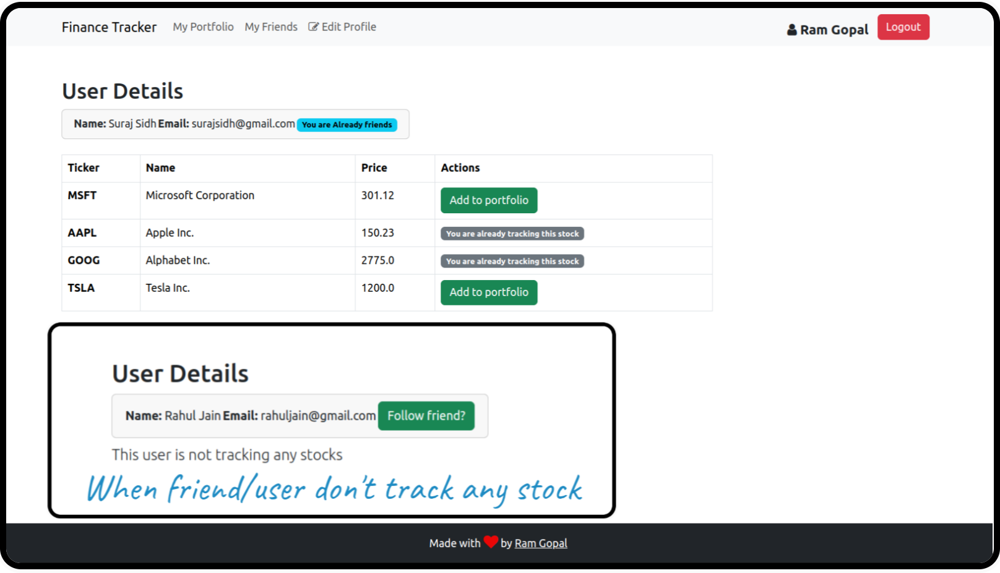
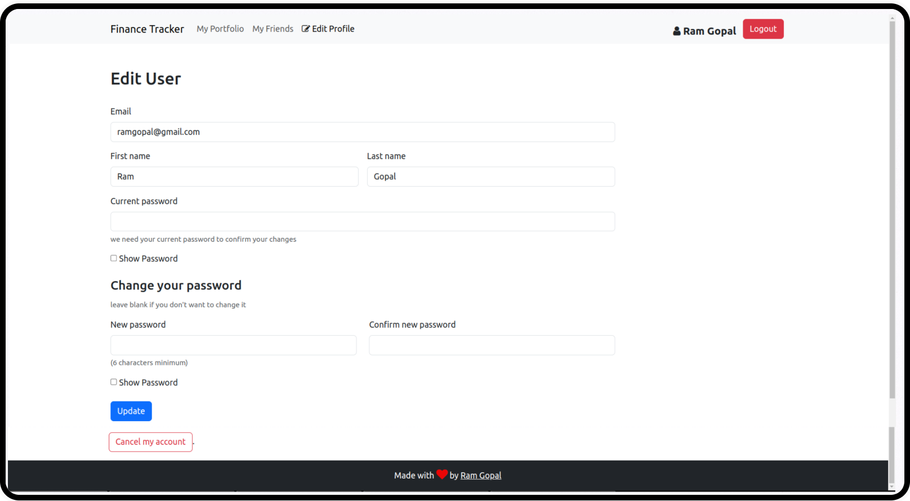

# Finance Tracker

- This is a Finance Tracker Build with RubyOnRails & Bootstrap
- Use [Devise](https://github.com/heartcombo/devise) for authentication

- ### Features
  1. You can search stock
  2. Add Stock in your's portfolio
  3. You can track upto 10 stocks at a time
  4. You can search user
  5. You can also show other user's profile
  6. In other user's profile see user info and tracked stocks
  7. You can also follow other user's
  8. You can Signup/Create your profile
  9. You can edit your profile

---
## YouTube demo video link 

 - ### Project's YouTube video link :- https://youtu.be/jxFF07Vagnk
---

#### This Project is part of [Udemy Course "The Complete Ruby on Rails Developer Course"](https://www.udemy.com/course/the-complete-ruby-on-rails-developer-course/)

---

#### For more info OR suggestion contact me on

- ### My Twitter :- <a href="https://twitter.com/ramgopalsiddh1/"> Twitter/ramgopal </a>

- ### Portfolio :- <a href="https://ramgopal.dev/">ramgopal.dev</a>
---

## Screenshots

#### Sign up page
  

#### Log in page
  

#### Home/welcome page
  

#### My Portfolio
  

#### My friends
  

#### User/friends details
  

#### Edit user info page
  

# README

This README would normally document whatever steps are necessary to get the
application up and running.

Things you may want to cover:

* Rails version: 7.1.3

* Ruby version: ruby 3.2.3 (2024-01-18 revision 52bb2ac0a6) [x86_64-linux]

* [I Foloow This Article for Add Bootstrap 5 in Rails 7  ](https://medium.com/@pietropugliesi/javascript-bootstrap-asset-bundling-in-ruby-on-rails-7-3640a220f2ce)

* Use Devise Gem for authentication for more info visit [Devise Gem's Github](https://github.com/heartcombo/devise)

* For Setup this project follow these steps
  1. Get code 
  2. Run `bundle install` for install all Gem's from Gemfile
  3. Run `rails db:migrate` for run Migrations and create db
  4. Run Server `rails server`
  5. visit [localhost:3000](http://127.0.0.1:3000) 

* System dependencies

* Configuration

* Database creation

* Database initialization

* How to run the test suite

* Services (job queues, cache servers, search engines, etc.)

* Deployment instructions

* use device gem for Authantication

* ...
